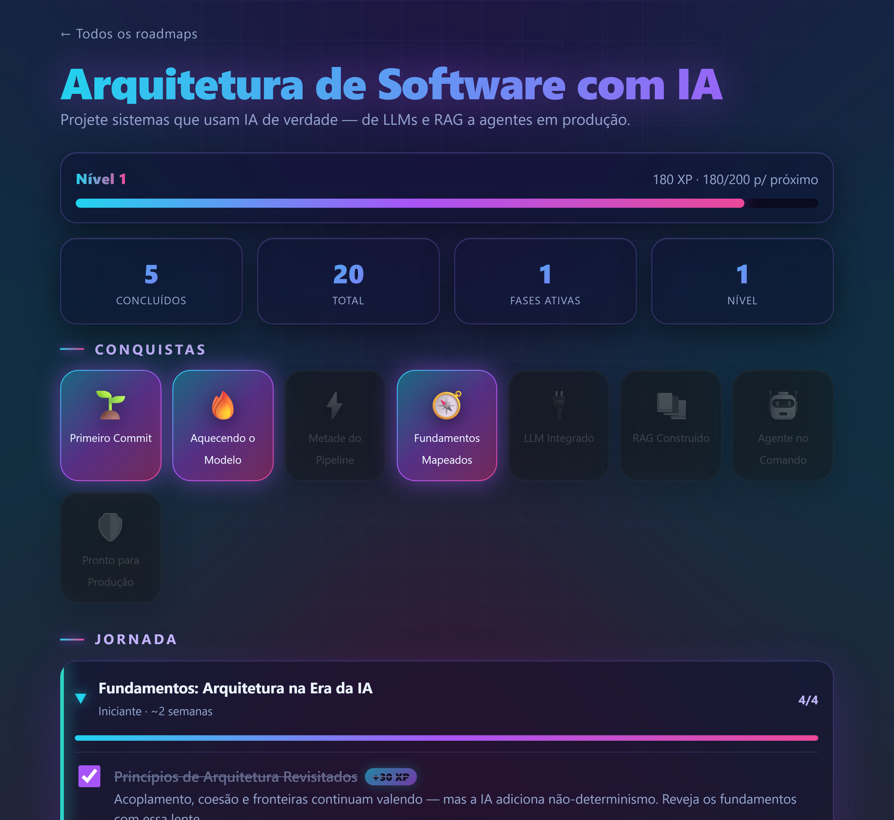
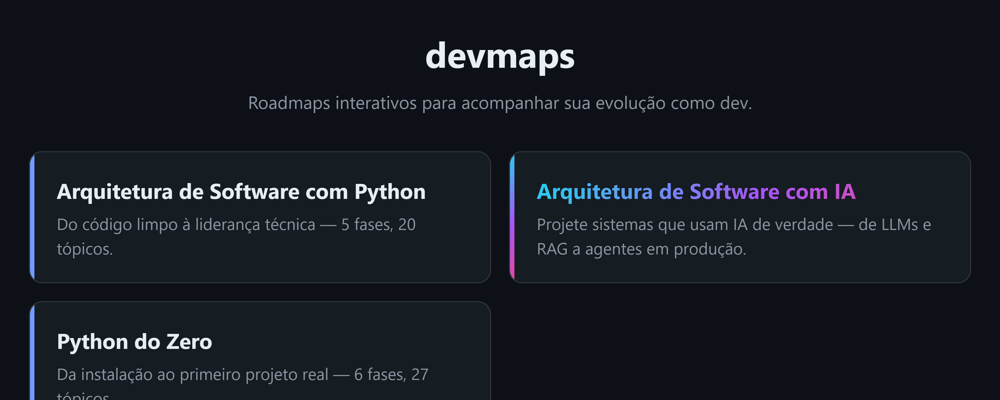

# devmaps

Roadmaps interativos, open source, para devs acompanharem a própria evolução.

Faça fork, conecte uma planilha Google e tenha em minutos um tracker de
aprendizado pessoal: progresso persistido, XP, níveis, badges e deploy gratuito
no GitHub Pages. **Sem npm, sem framework, sem servidor** — HTML, CSS e
JavaScript puro com ESModules nativos.



Vem com roadmaps de exemplo prontos — incluindo **Arquitetura de Software com
IA**, uma vitrine de personalização total: o mesmo motor dos outros, com um
visual completamente diferente (tema neon, efeitos 100% em CSS).

---

## Como funciona

- O widget marca tópicos, calcula XP/nível e desbloqueia badges.
- O progresso é salvo no **Google Sheets** (via Google Apps Script), ligado a
  um `userId` anônimo (UUID) guardado no seu navegador.
- A sincronização é protegida por um **token**: o backend só lê/grava se a
  requisição trouxer o token correto (que você define em `SCRIPT_TOKEN`). Por
  isso o site pode ser público — quem não tem o token usa normalmente, mas o
  progresso fica só no navegador dele e **ninguém escreve na sua planilha**.
- Sem `scriptUrl` ou sem token, tudo funciona igual usando **localStorage** —
  só não sincroniza entre dispositivos. Nada quebra.

```
core/      → engine.js (lógica pura), sheets.js (persistência),
             sync-ui.js (barra de sync), theme.js (tema por roadmap), widget.css
roadmaps/  → um roadmap por pasta (index.html + config.js + data.js)
template/  → base para criar um roadmap novo
sheets/    → Code.gs, o backend em Google Apps Script
index.html → home que lista os roadmaps
```

---

## Setup em 5 passos

### 1. Faça o fork e habilite o GitHub Pages

Faça fork deste repositório. Em **Settings → Pages → Source**, escolha
**Deploy from a branch** e selecione a branch principal com a pasta `/ (root)`.
O site é publicado a cada push — não há build (o `.nojekyll` garante que as
pastas sejam servidas como estão).

> Só quer testar localmente? Pule para o final: "Rodando localmente".

### 2. Crie a planilha e o backend

1. Crie uma planilha nova no [Google Sheets](https://sheets.new).
2. Vá em **Extensões → Apps Script**.
3. Apague o conteúdo padrão e cole tudo de [`sheets/Code.gs`](sheets/Code.gs).
4. Salve.

As abas `progress` e `notes` são criadas automaticamente no primeiro salvamento.

### 3. Publique o Apps Script como Web App

No editor do Apps Script: **Implantar → Nova implantação → App da Web**.

- **Executar como:** Eu (sua conta)
- **Quem tem acesso:** Qualquer pessoa

Copie a URL gerada (termina em `/exec`).

### 4. Defina seu token de sincronização

Ainda no editor do Apps Script: **engrenagem (Configurações do projeto) →
Propriedades do script → Adicionar propriedade**.

- **Propriedade:** `SCRIPT_TOKEN`
- **Valor:** uma senha longa e aleatória (gere uma com um gerenciador de senhas)

Esse token é o segredo que autoriza ler e gravar na sua planilha. Ele **não vai
para o repositório** — fica só aqui e no seu navegador. Sem ele, qualquer
visitante do site cai no modo local e nunca escreve nos seus dados.

### 5. Cole a URL no config do roadmap

Em `roadmaps/arquitetura-software/config.js`, preencha `scriptUrl`:

```js
export default {
  id: 'arquitetura-software',
  title: 'Arquitetura de Software com Python',
  subtitle: 'Do código limpo à liderança técnica — 5 fases, 20 tópicos.',
  scriptUrl: 'https://script.google.com/macros/s/SEU_ID/exec',
};
```

A **mesma** `scriptUrl` serve para todos os roadmaps — o backend separa os dados
por `roadmapId`. Como o token protege a gravação, dá para commitar a URL sem medo.

### 6. Faça commit e push

```bash
git add .
git commit -m "chore: configura minha planilha"
git push
```

O GitHub Pages publica em `https://<seu-usuario>.github.io/<repo>/`.

### 7. Conecte seus dispositivos

Abra o site no PC e no celular. Na **barra de sincronização** no topo do
roadmap, cole o seu `SCRIPT_TOKEN` e clique em **Conectar**. O token fica salvo
naquele navegador e o progresso passa a sincronizar entre todos os aparelhos
conectados. 🎉

---

## Rodando localmente

ESModules exigem um servidor HTTP (não funciona abrindo o arquivo direto).
Qualquer um serve:

```bash
python -m http.server 8000
# então abra http://localhost:8000/
```

Sem `scriptUrl` (ou sem token conectado), o progresso fica no localStorage do
navegador.

---

## Criando o seu próprio roadmap

Veja o [CONTRIBUTING.md](CONTRIBUTING.md). Em resumo: copie `template/` para
`roadmaps/<seu-roadmap>/`, gere o `data.js` com o prompt em
[`template/PROMPT_CLAUDE.md`](template/PROMPT_CLAUDE.md) e adicione o slug à
lista na home (`index.html`).

### Personalizando o visual

O design base fica em [`core/widget.css`](core/widget.css), com os tokens de cor,
espaçamento e arredondamento no `:root`. Há dois níveis de customização:

- **Global** (todos os roadmaps + home): edite os tokens em `core/widget.css`.
- **Por roadmap** (cada um com a própria cara): adicione um objeto `theme` ao
  `config.js` daquele roadmap, sem tocar no core. As chaves são as variáveis CSS
  sem o prefixo `--`:

  ```js
  export default {
    id: 'meu-roadmap',
    // ...
    theme: { accent: '#a371f7', bg: '#0b0b14', radius: '16px' },
  };
  ```

- **Restyle completo de um roadmap** (layout, cards, animações — não só cor):
  dê a ele uma folha de estilo própria com `stylesheet` no config. Ela é
  carregada depois do `widget.css`, então sobrescreve o que quiser, usando os
  nomes de classe como contrato (`.phase`, `.topic`, `.badge`, `.xp-bar`...):

  ```js
  export default {
    id: 'meu-roadmap',
    // ...
    stylesheet: './estilo.css',
  };
  ```

  Há um [`template/estilo.css`](template/estilo.css) de exemplo para começar.
  Peça um CSS para uma IA, salve na pasta do roadmap, aponte no config e pronto.

- **Card na home** (a listagem também reflete o roadmap): por padrão o card usa
  o `accent` do `theme`. Para um card com gradiente próprio, defina `cardGradient`
  (ou `cardAccent` para uma cor sólida) no config:

  ```js
  export default {
    id: 'meu-roadmap',
    // ...
    cardGradient: 'linear-gradient(110deg, #22d3ee, #a855f7, #ec4899)',
  };
  ```

O roadmap **Arquitetura de Software com IA** é um exemplo vivo de todos esses
níveis juntos (`theme` + `stylesheet` + `cardGradient`) — compare-o com os
outros para ver a mesma estrutura com uma cara totalmente diferente.



> **Atenção:** se o design que você quer copiar depende de **efeitos em JS**
> (animações por script, interações, comportamento dinâmico), só CSS não basta —
> aí você vai mexer também nas funções de render do `index.html` do roadmap, e
> isso muda bem mais que o estilo. Dica: **esgote o que dá para fazer só com CSS**
> (transições, `@keyframes`, `:hover`/`:focus`, grid/flex, `::before`/`::after`)
> antes de partir para o JS — você vai longe sem script nenhum.

---

## FAQ

**Preciso saber programar para criar meu roadmap?**
Não. O conteúdo fica em `data.js`, que é só dados (fases, tópicos, badges). Edite
à mão seguindo o exemplo, ou peça para uma IA gerar com o prompt em
[`template/PROMPT_CLAUDE.md`](template/PROMPT_CLAUDE.md).

**Onde meu progresso fica salvo?**
Por padrão, no `localStorage` do navegador (só naquele aparelho). Se você
configurar uma planilha e conectar com seu token, ele sincroniza no Google Sheets
e aparece em qualquer dispositivo.

**Se o site é público, outras pessoas conseguem ver ou bagunçar meu progresso?**
Não. Cada navegador tem um `userId` anônimo próprio, então o progresso de cada um
fica separado. E gravar na sua planilha exige o **token** — quem não tem usa o
site em modo local e nunca toca nos seus dados.

**Preciso de uma planilha nova para cada roadmap?**
Não. Uma planilha serve para todos: o backend separa os dados por `roadmapId`.
Use a mesma `scriptUrl` em todos os `config.js`.

**É de graça?**
Sim. GitHub Pages hospeda o site e Google Sheets + Apps Script fazem o backend —
tudo no plano gratuito.

**Dá para usar no celular?**
Sim. Depois de publicar, abra o site no celular e cole seu token uma vez na barra
de sincronização. O progresso passa a sincronizar entre todos os aparelhos.

**Posso mudar só as cores ou o visual inteiro?**
Os dois. `theme` troca cores/espaçamento; `stylesheet` reestiliza tudo (layout,
animações); `cardGradient` muda o card na home. Veja "Personalizando o visual".

**Esqueci/quero trocar meu token. E agora?**
Atualize a propriedade `SCRIPT_TOKEN` no Apps Script e reconecte nos seus
dispositivos com o novo valor. O progresso já salvo na planilha continua lá.

**Funciona sem internet?**
O modo local funciona offline (salva no navegador). A sincronização com a
planilha precisa de conexão.

---

## Licença

MIT.
